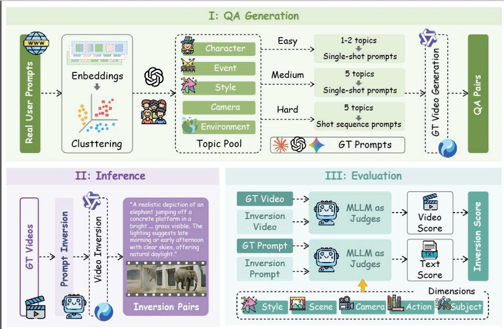
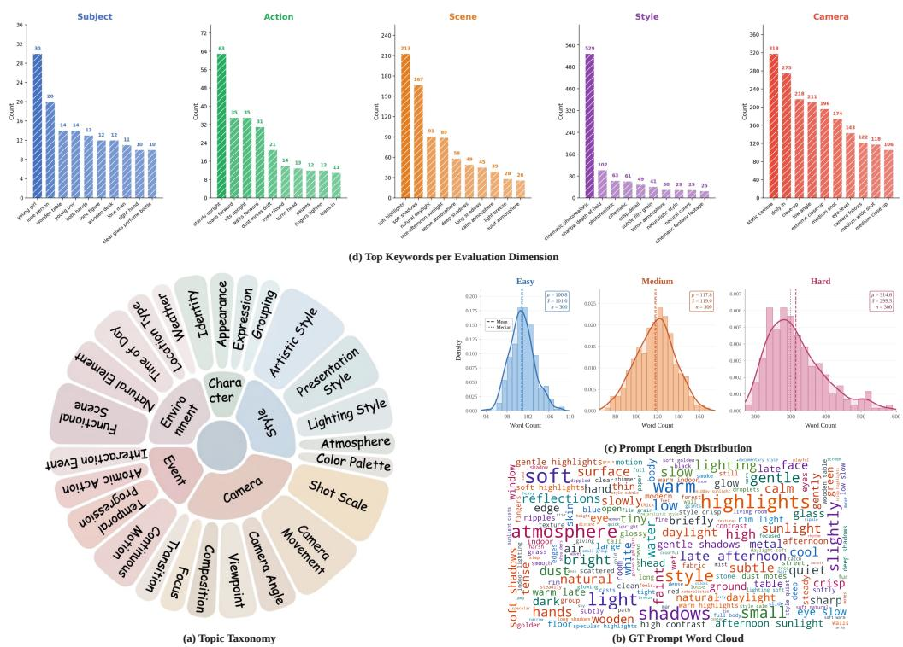

<p align="center">
  <h1 align="center">VI-Bench: Benchmarking Video Language Models via Video Prompt Inversion</h1>
</p>

<p align="center">
  <a href="https://arxiv.org/abs/xxxx.xxxxx"></a>
  <a href="https://huggingface.co/datasets/aba122/VI-Bench"></a>
  <a href="https://github.com/aba122/VI-Bench"></a>
</p>

---

## News

- **[2025/05]** VI-Bench is released! We provide the benchmark dataset, evaluation pipeline, and inference scripts for 18+ Video Language Models.

## Overview

**VI-Bench** is a benchmark for evaluating Video Language Models (VLMs) through **Video Prompt Inversion** — the task of reverse-engineering the text prompt used to generate an AI-generated video.

<p align="center">
  
</p>

The core pipeline:

1. **Input**: AI-generated videos (produced by Hunyuan-Distill and Wan 2.1) at three difficulty levels.
2. **Inversion**: A VLM watches the video and infers the original generation prompt.
3. **Re-generation**: The inferred prompt is used to regenerate a new video.
4. **Evaluation**: Multiple metrics compare the re-generated video against the original.

### Difficulty Levels

| Level | Description | Prompt Complexity | Output Format |
|-------|------------|-------------------|---------------|
| **Easy** | Single shot, content-only prompt (~100 words) | Low | `["prompt"]` |
| **Medium** | Single shot, prompt with style & camera descriptions | Medium | `["prompt"]` |
| **Hard** | Multi-shot video, per-shot prompts | High | `{"shots": N, "shot_1": "...", ...}` |

### Benchmark Statistics

- **300** unique prompt topics (from DiffusionDB & VidProM)
- **~900** AI-generated videos across 3 difficulty levels
- **2** video generation models: Hunyuan-Distill (480p) and Wan 2.1 (480x832)
- **5** evaluation dimensions: Subject, Action, Scene, Style, Camera

<p align="center">
  
</p>

## Evaluated Models

We evaluate **18 Video Language Models** spanning open-source and proprietary:

| Model | Size | Type |
|-------|------|------|
| Qwen2.5-VL | 3B / 7B / 32B / 72B | Open |
| Qwen3-VL | 4B / 8B / 30B | Open |
| Qwen3.5 | - | Open |
| InternVL2.5 | 8B | Open |
| InternVL3 | 8B | Open |
| LLaVA-Video | 7B | Open |
| Video-LLaMA3 | 7B | Open |
| OmniVinci | - | Open |
| Keye-VL | 8B | Open |
| GPT-4o | - | Proprietary |
| Doubao-Seed-2.0-pro | - | Proprietary |

## Quick Start

### 1. Dataset

Download the dataset from [HuggingFace](https://huggingface.co/datasets/aba122/VI-Bench) or prepare it locally:

```
data/
├── Bench_Prompts/
│   ├── Easy.json          # Easy-level GT prompts
│   ├── Medium.json        # Medium-level GT prompts (with style & camera)
│   └── Hard.json          # Hard-level GT prompts (multi-shot)
└── Videos/
    ├── Split_A.json       # Video metadata & paths
    └── Split_B.json
```

### 2. Inference

Run VLM inference to invert video prompts:

```bash
# Example: Qwen3-VL (multi-GPU)
CUDA_VISIBLE_DEVICES=0,1 python inference/Qwen3-VL.py

# Example: Data-parallel mode
CUDA_VISIBLE_DEVICES=0 python inference/Intern-VL3.py --rank 0 --world-size 2 &
CUDA_VISIBLE_DEVICES=1 python inference/Intern-VL3.py --rank 1 --world-size 2 &

# Example: API-based model
python inference/GPT-4o.py
```

All inference scripts output results to `results/{model}.json`.

### 3. Video Re-generation

Generate videos from inferred prompts:

```bash
python inference/Video-Generate.py \
    --input results/Qwen3-VL.json \
    --gpus 0,1,2,3
```

### 4. Evaluation

```bash
# LLM-Judge (5-dimension text evaluation)
python evaluation/LLM-Judge.py --input results/Qwen3-VL.json

# Semantic Unit Recovery
python evaluation/semantic_unit_recovery.py

# Video-EvalAgent (agent-based video evaluation)
python evaluation/video_eval_agent.py --input results/Video/Qwen3-VL_Video.json
```

## Project Structure

```
VI-Bench/
├── data/                   # Dataset (prompts, video metadata)
│   ├── Bench_Prompts/      # GT prompts (Easy / Medium / Hard)
│   └── Videos/             # Video path indices (Split_A.json, Split_B.json)
├── inference/              # VLM inference scripts (18 models)
│   ├── Qwen3-VL.py
│   ├── GPT-4o.py
│   ├── Video-Generate.py   # Video re-generation
│   └── ...
├── evaluation/             # Evaluation scripts
│   ├── LLM-Judge.py        # LLM-based 5-dim scoring
│   ├── semantic_unit_recovery.py
│   ├── Video-EvalAgent/    # Agent-based video evaluation
│   └── ...
└── assets/                 # Figures for README
```

## License

This project is released under the [MIT License](LICENSE).
